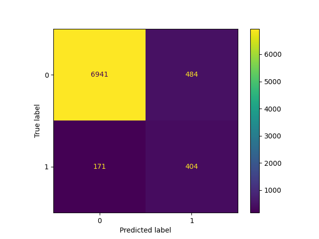

# Summary
This is an analysis of a marketing campaign from a bank institution. The goal is to predict if a client will subscribe to a term deposit.

The dataset is composed of demographic, financial and marketing data for 40000 clients. It is subset of the one available at https://archive.ics.uci.edu/ml/datasets/Bank+Marketing.

XBoost is used to model this binary classification problem

# Details

This project analizes real data from a marketing campaign in the bank sector. The goal is to build a machine learning model that predicts the success of the campaign as a function of the clients demographics and financial situation, as well as how the marketing campaign was performed (what methods were used and how).

The data comes from direct marketing efforts of a European banking institution. The marketing campaign involves making a phone call to a customer, often multiple times to ensure a product subscription, in this case a term deposit. Term deposits are usually short-term deposits with maturities ranging from one month to a few years.

First, we explore the data visually to get a sense of what it is about, what are the potential uses of each feature and how they can be preprocessed. Then, we will use the XGBoost model to build an effective classifier with a proper balance between the recall and precision.

We put a lot of focus on the feature engineering part, since it has been key to get a good performance. We will not pay much attention to hyperparameter tuning, since simple values already got good scores. The cross-entropy and the ROC AUC are the main metrics we have used in order to evaluate performance The reasons that support such choices are exposed along the way.

# Conclusions

The biggest improvement in results has come from feature engineering. Namely, capping the outliers from numerical variables duration, balance, and campaign, grouping jobs into three categories (non-workers, white-collar and blue-collar), classifying days in payroll days and non-payroll days, and grouping age into four groups.

Hyperparameter search using crossvalidation was used (max_depth, learning_rate, early_stopping_rounds, min_child_weight, scale_pos_weight), but there was not a significative improvement, so a model with default values for hyperparameters except for the early_stopping_rounds (set to 50 rounds) already presents good performance.

The most relevant features have been duration, month, balance and campaign. This means they have the most predictive power, but that does not necessarily imply causality. Especially for duration, it is very likely that successful deals are the cause of longer calls, and not the other way around. However the opposite is likely true for balance. So focusing on clients with higher balance is a single classification criteria that will yield good results.

The decreasing success rate related to more calls during the campaign suggests that resources shouldn't be wasted in clients with more than 4 calls accumulated.

The trained model with previously mentioned feature transformations and default hyperparameters, achieves a recall of 70% for a precision of 45.7%, which is pretty good since in the dataset there was only a 7% of successful cases. This can be achieved by lowering the predicted probability threshold from 0.5 (the default value) to 0.25.

